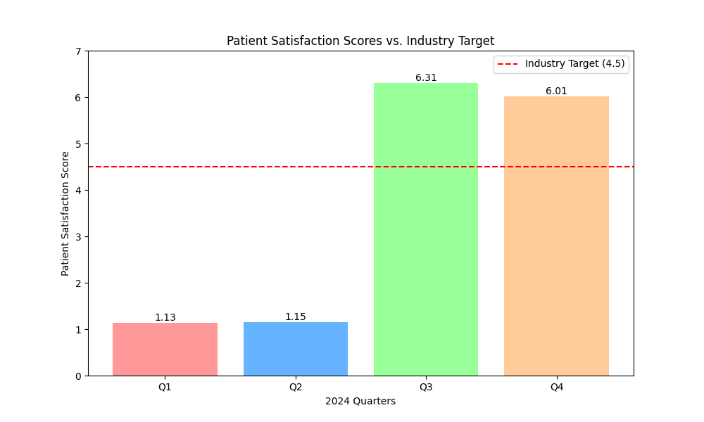

# Healthcare Performance Analysis: A Data Story

## The Challenge: Below-Average Patient Satisfaction

Our healthcare company is facing a critical challenge: a concerning trend in patient satisfaction scores. Our current average patient satisfaction score is **3.65**, which is significantly below the industry benchmark target of **4.5**. This data story provides a comprehensive analysis of our quarterly performance data, identifies the key issues, and offers actionable recommendations to improve patient experience.

## Quarterly Performance Analysis

The following chart visualizes our patient satisfaction scores for each quarter of 2024, compared to the industry target.

As the chart clearly shows, our scores in Q1 (1.13) and Q2 (1.15) were extremely low, while Q3 (6.31) and Q4 (6.01) showed a significant improvement. Despite this positive trend in the latter half of the year, the overall average remains well below the target.

### Key Findings

*   **Inconsistent Performance:** There is a stark contrast between the first and second halves of the year, indicating a significant operational change or intervention occurred mid-year.
*   **Below-Target Average:** The calculated average satisfaction score for 2024 is **3.65**, which is 18.9% below the industry target of 4.5.
*   **Positive Momentum:** The strong performance in Q3 and Q4 suggests that recent initiatives may be effective and should be sustained and expanded upon.

## Business Implications

The current trend has several serious business implications:

*   **Reputation Damage:** Consistently low patient satisfaction scores can damage our brand's reputation, making it difficult to attract new patients.
*   **Patient Churn:** Dissatisfied patients are more likely to seek care elsewhere, leading to a loss of revenue and market share.
*   **Decreased Staff Morale:** A stressful environment with unhappy patients can lead to burnout and high turnover among our dedicated staff.

## Recommendations for a 4.5 Target

To reach our target of a 4.5 average patient satisfaction score, we must focus on two key areas: **improving service quality and reducing wait times.**

Here are specific, actionable recommendations:

1.  **Enhance Service Quality:**
    *   **Invest in Staff Training:** Implement a comprehensive customer service training program for all patient-facing staff, focusing on empathy, communication, and problem-solving.
    *   **Personalize the Patient Experience:** Leverage our patient data to personalize interactions and care plans, making patients feel valued and understood.

2.  **Reduce Wait Times:**
    *   **Optimize Scheduling Systems:** Implement a new AI-powered scheduling system to predict patient flow, reduce bottlenecks, and minimize wait times.
    *   **Improve Clinic Workflow:** Redesign our clinic workflows to streamline patient check-in, triage, and discharge processes.

By implementing these recommendations, we can build on the positive momentum from the second half of the year and create a consistently excellent patient experience, ultimately achieving our goal of a 4.5 satisfaction score.

---

*This analysis was completed by a senior data analyst. For any inquiries, please contact: 24f2001055@ds.study.iitm.ac.in*
